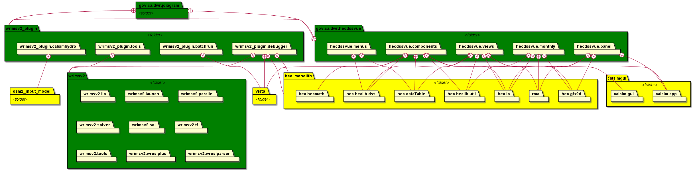

# WRIMS: Water Resource Integrated Modeling System
a generalized water resources modeling system for evaluating operational alternatives of large, complex river basins. WRIMS integrates a simulation language for flexible operational criteria specification, a linear programming solver for efficient water allocation decisions, and graphics capabilities for ease of use. These combined capabilities provide a comprehensive and powerful modeling tool for water resource systems simulation.
- https://water.ca.gov/Library/Modeling-and-Analysis/Modeling-Platforms/Water-Resource-Integrated-Modeling-System

## WRIMS with HEC-DSS version 7 library
We are modernizing WRIMS and its development. This work updates WRIMS dependencies on HEC-DSS, the US Army Corps of 
Engineers data storage system. This allows WRIMS to read and write files using version 7 of the DSS data format. It 
is also a step toward devOps-style development, automating the integration of HEC-DSS libraries from HEC's artifact 
management system, rather than relying on manual updates or building locally from source.

## An evolving build system
WRIMS can be built from this repository following the procedure described [here](./README.build.md). 
As part of the movement toward devOps development, dependency analyses and proposals for re-organization of the 
build have been added as README files within components of this repository.

## WRIMS GUI dependencies
The WRIMS GUI is a plugin to Eclipse's Equinox RCP (Rich Client Platform). Its components include the packages 
listed below, with indicated dependencies on other packages managed here (i.e. excluding external jars from java, 
eclipse, etc.)

- [gov.ca.dwr.jdiagram](./gov.ca.dwr.jdiagram/README.md)
- [gov.ca.dwr.hecdssvue](./gov.ca.dwr.hecdssvue/README.md)
- [wrimsv2_plugin](./wrims_v2/wrimsv2_plugin/README.md)
- [WRIMSv2](./wrims_v2/wrims_v2/README.md)

## DevOps Migration
The "wrims_v2" directory here contains files and directories from the WRIMS project as it existed before the DevOps revisions were started.
All other files and folders at the root level in this branch and its descendants are structured to support GitHub-style CI/CD builds with Gradle.

Directories here:
-  .github/workflow -- home to the GitHub workflows that build WRIMS components on the GitHub site
-  buildSrc -- Holds build configuration information common to all subprojects. For specifics, see Gradle documentation https://docs.gradle.org/current/userguide/organizing_gradle_projects.html#sec:build_sources
-  gradle -- configurations for the gradle build, most significantly the file "libs.version.toml" which sets the version numbers for the libraries that will be retrieved from Maven Central or other artifact repositories at build time
-  wrims-core -- the gradle sub-project that produces the equivalent of the previous WRIMSv2.jar file
-  wrims_v2 -- see above

The remaining files at this level are set up to support a mult-project gradle build as described at https://docs.gradle.org/current/userguide/intro_multi_project_builds.html

Files were moved (rather than copied) from wrims_v2/wrims_v2/src to new locations in wrims-core/src so that their git histories would be preserved. Source files for non-java program components were left in their original folders, and will be moved as the project goes forward. A [README file in wrims_v2/wrims_v2/src](./wrims_v2/wrims_v2/src/README.md) lists the groups of files that were moved and left behind.

The jar that's built from this branch (wrims-core) of the project does not contain the
antler classes. To run wrims using this jar, you'll need to include the antler runtime (v 3.5.2)
in addition to the wrims-core jar to replace the old WRIMSv2.jar.

